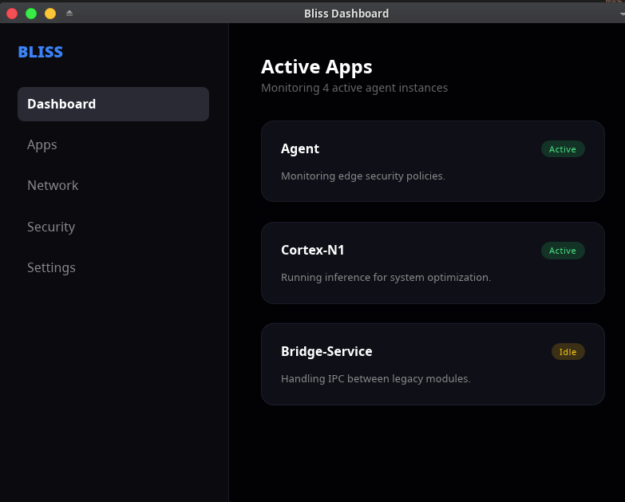
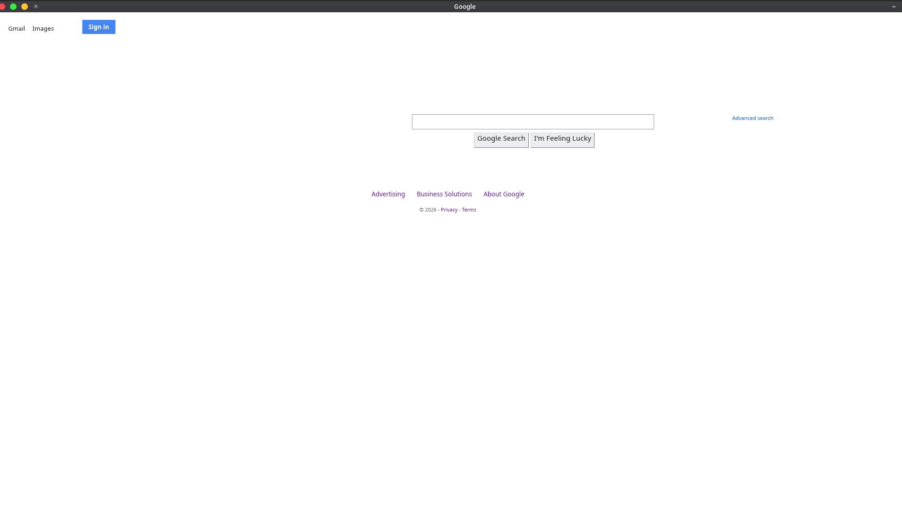

<p align="center">
  
</p>

# 🌌 Bliss Engine

**The Agent-Native, Radically Modular HTML/CSS Rendering Stack**

Bliss (forked from [Blitz](https://github.com/DioxusLabs/blitz)) is a specialized rendering engine designed for the **Exosphere Ecosystem**. It reimagines the browser as a secure, polyglot runtime where AI agents and human users interact through a capability-gated interface.

[](https://github.com/nixpt/bliss-engine/actions)
[](#license)
[](https://github.com/nixpt/exosphere)

---

## 🚀 The Exosphere Fork: Why Bliss?

Bliss structural divergence from upstream Blitz is driven by the requirements of an **Agent-Native Operating System**:

1.  **Polyglot Scripting**: Unlike engines tied to JavaScript, Bliss supports **any** language in the Exosphere mesh (Crush, Python, Lua, etc.) via the `ScriptEngine` trait.
2.  **Capability-Gated Rendering**: Direct integration with the **Exosphere Identity Protocol (XIP)**. DOM segments are cryptographically gated, ensuring agents only see/mutate what they are authorized to.
3.  **Simulation-Aware**: Hooks for state serialization that align with **Event Horizon's** relativistic time intervals (ST/DT).
4.  **Asynchronous Non-Blocking**: A decoupled messaging architecture that ensures the UI remains responsive even during heavy agent inference or tick processing.

## 🛠️ Getting Started

### 1. Unified Workspace (Recommended)
Bliss is designed to be used within the [Exosphere Meta-Repo](https://github.com/nixpt/exosphere). 
```bash
git clone --recurse-submodules https://github.com/nixpt/exosphere.git
cd exosphere
make build
```

### 2. Standalone Development
1. Clone this repo:
   ```bash
   git clone https://github.com/nixpt/bliss-engine.git
   cd bliss-engine
   ```
2. Build the workspace:
   ```bash
   cargo build
   ```
3. Run an example:
   ```bash
   cargo run --release --example hello
   cargo run --release --example dashboard
   cargo run --release --example react
   ```

## 📸 Screenshots

<p align="center">
  
  <br>
  <i>The Exosphere Dashboard rendered in Bliss Engine</i>
</p>

<p align="center">
  
  <br>
  <i>Google rendered in a Bliss-based browser</i>
</p>

## 🏗️ Architecture: The Bliss Stack

Bliss is comprised of granular, modular crates that can be combined or replaced:

### Core Modules
- **`bliss-dom`**: The heart of the engine. Handles style resolution (Stylo), layout (Taffy), and text rendering (Parley).
- **`bliss-traits`**: The shared interface layer for the entire ecosystem.
- **`bliss-net`**: Extensible networking layer supporting `http://`, `file://`, and `exo://` (XIP) protocols.

### Integration Modules
- **`bliss-html`**: HTML5/XHTML parsing via `html5ever`.
- **`bliss-paint`**: Layout-to-Render translation for anyrender backends.
- **`bliss-shell`**: System integration for windowing and native event loops.

---

## 🌉 Relationship to Upstream

We maintain a "Hard Fork" for architectural divergence while tracking generic improvements:
- We track upstream **Stylo** and **Taffy** updates.
- We contribute generic layout/CSS bug fixes back to the Dioxus Labs ecosystem.
- Architectural changes for Agent-OS integration remain exclusive to Bliss.

## 📜 License

Bliss is dual-licensed under **MIT** or **Apache-2.0**.
The `stylo_taffy` crate is additionally licensed under **MPL 2.0**.

---
*Exosphere: The World is a Mesh.*
